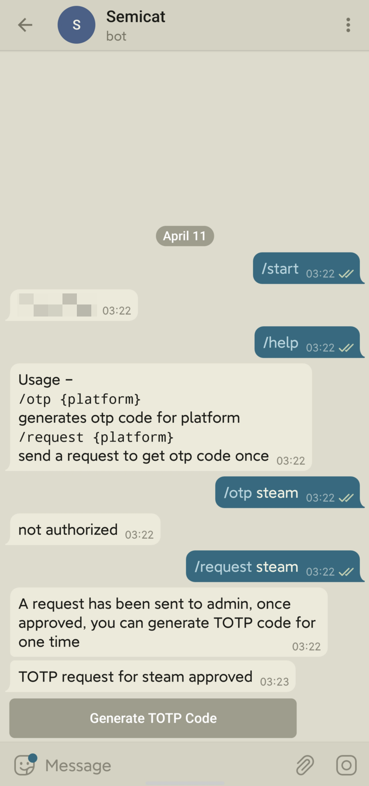

# telegram-otp-bot

You can share some 2FA-enabled accounts with friends you trust on Telegram (not safe),
or use it as an extra approval step for your private website registration process.

## Usage

- if you don't have a bot, checkout [BotFather](https://t.me/BotFather) first to create one
- clone this repository
- run `npm install` to install dependencies
- create an otp.json with the following content

```json
{
  "$schema": "./config.schema.json",
  "bot_token": "token_of_the_bot",
  "admin": epiclion69,
  "totp": [
    {
      "name": "steam",
      "secret": "totp_secret",
      "authorized_ids": epiclion69
    },
  ],
  "proxy": {
    "host": "localhost",
    "port": 1080
  }
}
```

- run `npm start` to start the bot service. You can use pm2 / supervisord / systemd to daemonize the service.

You can get your own user id by starting with `{ admin: -1 }` and sending a `/start` command to the bot.

The admin user can always generate codes for any platform, and `authorized_ids` is a list of authorized user ids who can generate TOTP codes for that platform without approval.

For **any** Telegram users, they can send `/request {name}` to the bot to apply for a one-time TOTP code,
and it's at the admin's discretion to approve.

Every TOTP code generation by the bot will send a message to the admin for audit.

## Disclaimer

This program comes with **ABSOLUTELY NO WARRANTY** but here are some security tips:

DO NOT share the config file to others.

DO NOT share important accounts to others.

Once you think your server is under attack, you should regenerate 2FA secret for all services.

For some service providers, account sharing is forbidden.

## screenshots




## LICENSE

Credits to bitwarden/jslib, this project is licensed under GPLv3.
